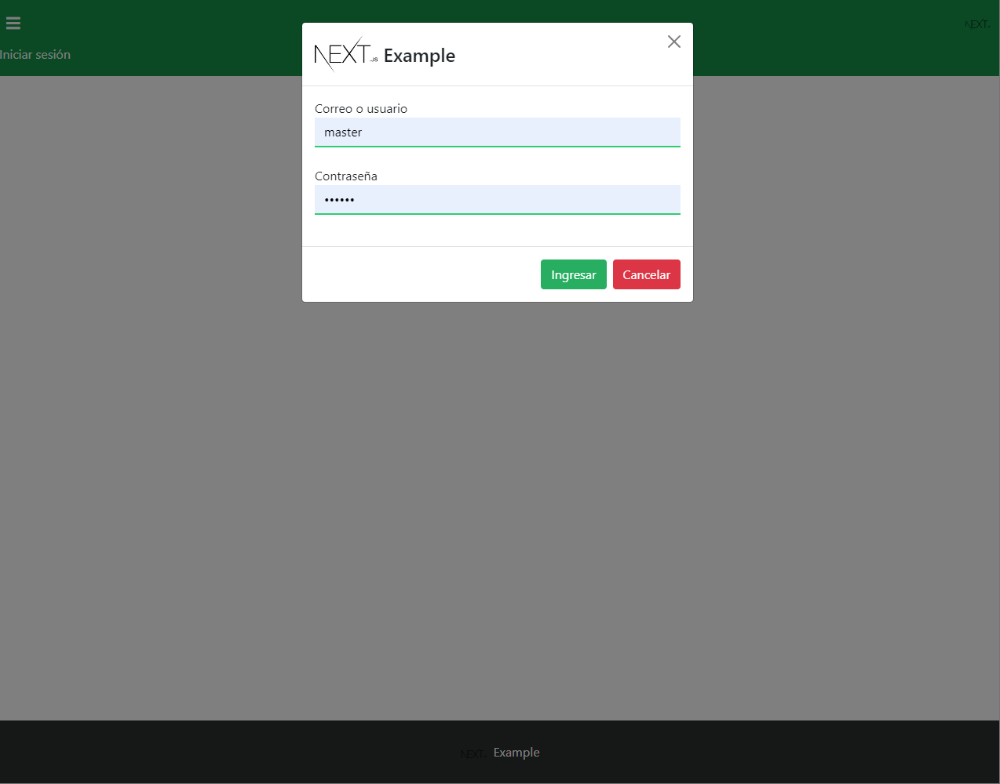

# Web app skeleton 🧑🏽‍💻

Get started web app skeleton for new projects with latest technologies

## Description

This skeleton use some technologies such:

* Nest Js Framework (Back-end)
* Next Js Framework (Frond-end)
* Apollo Framework (Graphql)
* Mongo DB (Database engine)
* JWT (Authorization method)
* PWA support

## Getting Started

### Dependencies

* Node.js
* Mongo DB

### Installing

### Initial database script

* npm i ( inside app and service folder )
* npm build ( inside app and service folder ) # Production build

### Executing program

* npm run start:dev ( inside app and service folder ) # Run on development mode
* npm run start ( inside app and service folder ) # Run on production mode

## Authors

* Juan Carballo - jpcbdev@gmail.com

## Version History

[CHANGE LOG](/CHANGELOG.md)

## License

MIT